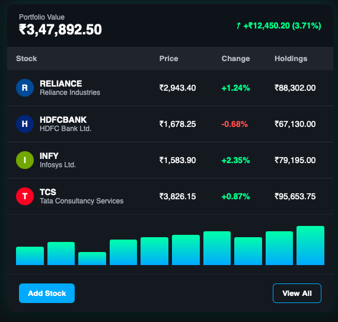

# 📊 Stock Portfolio Tracker

**A sophisticated web-based finance tracker with real-time market data and advanced portfolio analytics**

[🚀 **View Live Demo**](https://jayadityatracker.42web.io) • [📖 Documentation](#installation) • [🐛 Report Bug](https://github.com/jdtrystocode/Stock-Portfolio-Tracker-/issues)

---

## ✨ Features That Set This Apart

🔥 **Real-Time Stock Data Integration**
- Live price updates via Yahoo Finance API
- Automatic portfolio value calculations
- Real-time profit/loss tracking

📈 **Advanced Portfolio Analytics** 
- Performance metrics and insights
- Historical data visualization
- Portfolio diversification analysis

🔐 **Secure User Management**
- Encrypted user authentication
- Session-based security
- Protected user portfolios

🎨 **Modern UI/UX Design**
- Dark theme with neon accents
- Responsive design for all devices
- Glassmorphism effects and animations

⚡ **High Performance Architecture**
- Optimized database queries
- Efficient API integration
- Fast loading times

---

## 🎯 Live Demo

### 🌐 **[Experience the App Live →](https://jayadityatracker.42web.io)**

**Try it out:**
1. 📝 **Register** a new account
2. 🔑 **Login** with your credentials  
3. ➕ **Add stocks** to your portfolio
4. 📊 **Track performance** in real-time
5. 💰 **Monitor gains/losses**

---

## 🛠️ Tech Stack

| Frontend | Backend | Database | API | Hosting |
|----------|---------|----------|-----|---------|
|  |  |  |  |  |
|  |  |  |  |  |
|  |  |  |  |  |

---

## 🚀 Quick Start

### Prerequisites
- ✅ PHP 7.4 or higher
- ✅ MySQL 5.7 or higher  
- ✅ Web server (Apache/Nginx)
- ✅ Internet connection (for live stock data)

### 🔧 Installation

1. **Clone the repository**
